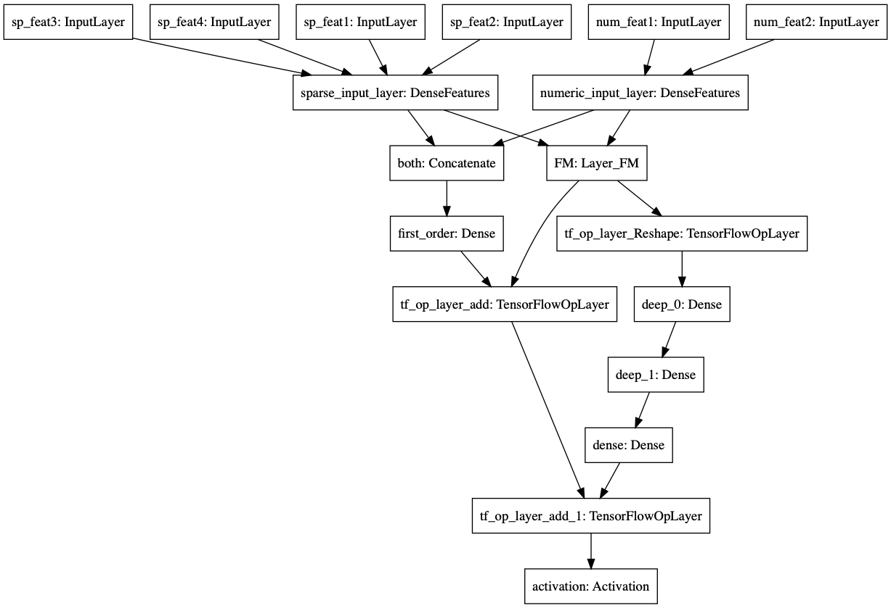

# DeepFM
An TensorFlow 2 and Keras implementation of the paper: [DeepFM, a Factorization-Machine based Neural Network for CTR Prediction](https://arxiv.org/abs/1703.04247).

## Done
1. Used feature_column and tf.data to perform feature engineering and built a TensorFlow input pipeline.

2. Implemented a custom Embedding layer and use Keras functional API to define the Model flexibly and elegantly.

## TODO
1. Add more feature column types supported.
2. Exact model definition as a class into a python file.
3. Use `tf.keras.estimator.model_to_estimator` to  convert the Keras model to an Estimator.
